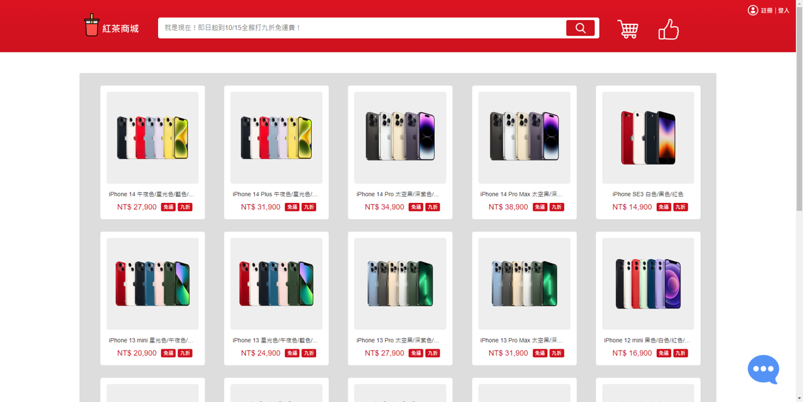
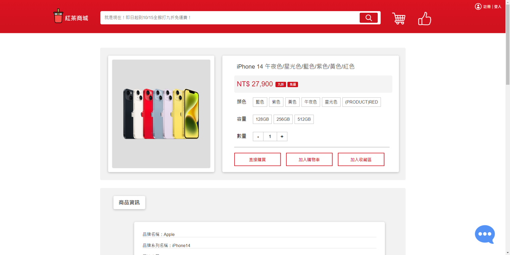
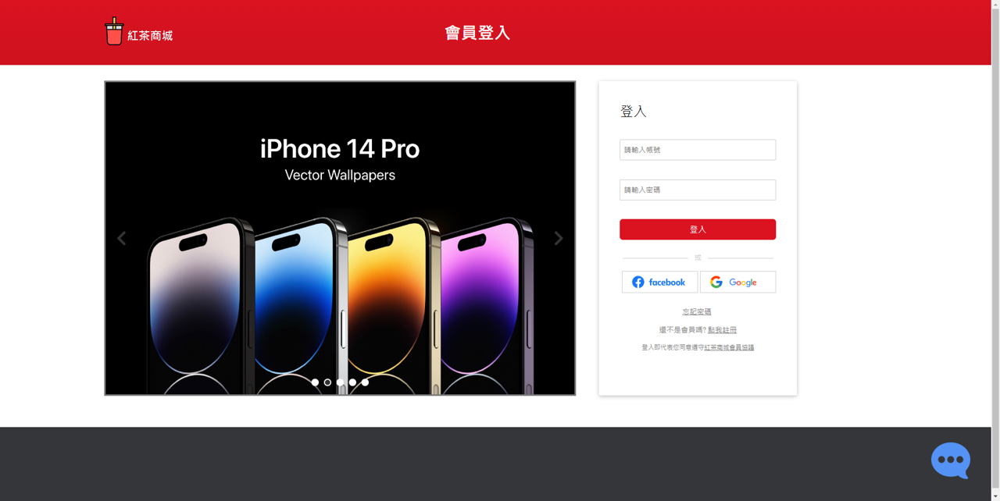
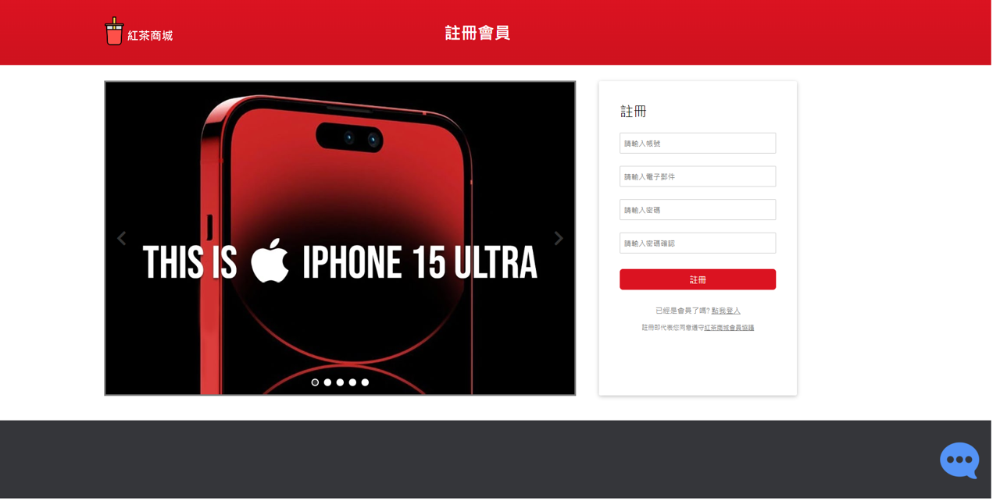
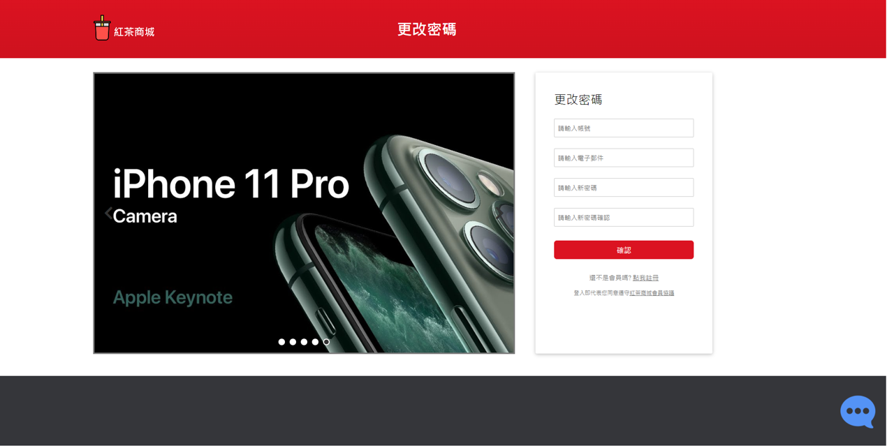

# BlackTea Store - Django Web Application

Welcome to the BlackTea Store README! This document provides an overview of the features, functionality, and potential future enhancements of the BlackTea Store web application.

## Example Site

Here are previews of the example pages for the BlackTea Store web application:

|  |  |  |
|:---:|:---:|:---:|
| **Home**  | **Product**  | **Cart** |

|  |  |  |
|:---:|:---:|:---:|
| **Login**  | **Register**  | **Change Password** |

## Table of Contents

- [Demo](#demo)
- [Features](#features)
  - [Main Page](#main-page)
  - [Search Bar](#search-bar)
  - [User Registration and Login](#user-registration-and-login)
  - [Change Password](#change-password)
  - [Product Information](#product-information)
  - [Product Reviews](#product-reviews)
  - [Shopping Cart](#shopping-cart)
  - [Related Products](#related-products)
- [Future Enhancements](#future-enhancements)
- [Technologies](#technologies)
- [Usage](#usage)
- [License](#license)

## Demo

Explore the [BlackTea Store Demo](http://blacktea-store.us-east-1.elasticbeanstalk.com/) to experience the application firsthand.

## Features

- **Main Page:** The main page of the BlackTea Store provides an enticing selection of featured black tea products. Users can quickly access product categories and other essential sections of the website.

- **Search Bar:** The integrated search bar allows users to find specific black tea products by entering relevant keywords. This feature ensures a seamless browsing experience.

- **User Registration and Login:** New users can easily create an account by registering with their username, email, and password. Registered users can securely log in to access personalized features and account settings.

- **Change Password:** Registered users have the convenience of changing their account password through a user-friendly interface, enhancing account security.

- **Product Information:** Detailed information about each black tea product is presented on dedicated product pages. Users can explore product descriptions, prices, and images. Furthermore, users can choose product variants and quantities and add items to their shopping cart.

- **Product Reviews:** Authenticated users have the ability to submit detailed product reviews, including star ratings and comments. They can edit and delete their reviews, contributing to an interactive and informative product experience.

- **Related Products:** Discover related black tea products conveniently listed at the bottom of product pages, allowing you to explore and find similar items of interest.

- **Shopping Cart:** Logged-in users can utilize the shopping cart feature, enabling them to adjust product quantities conveniently. The cart automatically calculates the total item count and overall order amount.

  
## Future Enhancements

The BlackTea Store team has exciting future enhancements planned, including:

- **Smart Customer Support:** Implementing an intelligent customer support system using AI chatbots to assist users.
- **Favorites Area:** Introduce a favorites area where users can save and manage their favorite black tea products for quicker access.
- **Payment Integration:** Integrate seamless payment gateways to simplify transactions for a better shopping experience.
- **Footer Customization:** Enhance the website's footer by adding relevant information and links to improve user navigation.

## Technologies

The BlackTea Store web application is built using the following technologies:

- Python
- Django Framework
- AWS (Amazon Web Services)
- SQLite

## Usage

Explore and enjoy the BlackTea Store web application:

1. Browse the main page and discover featured black tea products.
2. Use the search bar to find specific products quickly.
3. Register an account or log in to access personalized features.
4. Explore detailed product information and reviews.
5. Add products to the shopping cart and adjust quantities.
6. Experience the ease of changing your account password.

## License

The BlackTea Store web application is open-source software licensed under the [MIT License](LICENSE).

---

Thank you for exploring the BlackTea Store! Feel free to customize this README.md to match your project's unique details and requirements.
